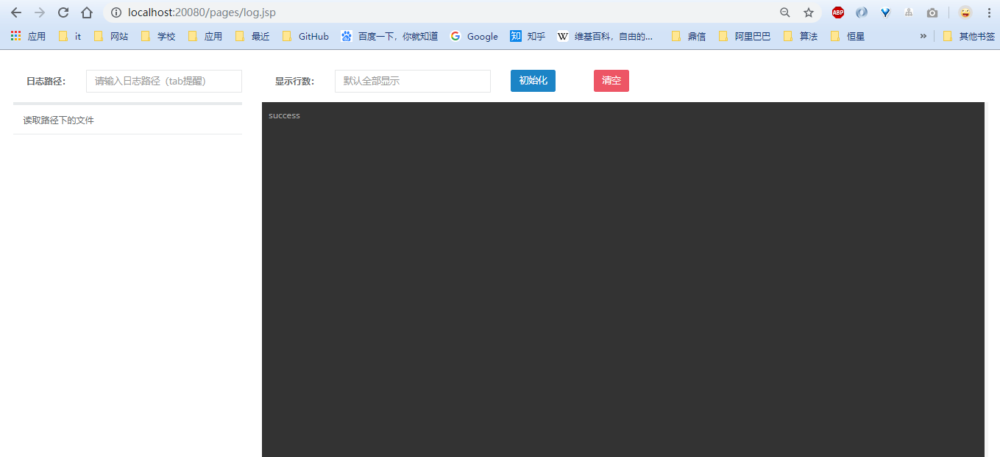
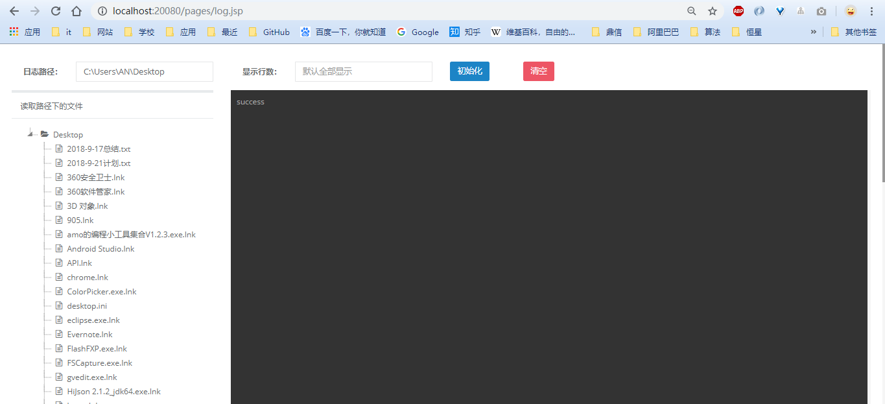

# 查看日志

## 程序运行

### 编译器

<center>如果是直接导入了编译器，如eclipse，直接run APP即可</center>

### 导出jar包

直接使用 `Java -jar ShowLog-0.0.1-SNAPSHOT.war`  即可运行

### 访问

http://localhost:20080/pages/log.jsp

界面展示：




输入路径（如果是运行在linux系统上，有tab提醒功能）后，点击初始化即可




<span style="color:red;font-weight:bold">注意：本系统暂不支持windows</span>

<span style="color:red;font-weight:bold">如果什么不对的或想交流的，联系方式QQ：1719120364</span>


## 思路

springboot 开发 web 项目，基于 tail -f 指令，可以动态查看日志内容，内容传输基于 websocket

参考链接：[Java用WebSocket + tail命令实现Web实时日志](https://www.cnblogs.com/shihaiming/p/6201678.html)


## 功能

* 文件路径的tab提醒（完成）
* 文件夹的初始化，采用 jstree 的方式显示（完成）
* 基于 websocket 传输（完成）
* 添加清除内容的按钮（完成）
* 添加指定行数的输入框（完成）
* 可以在line中查看是否包含error、ERROR、exception、Exception（未完成）
  * 思路：
    * 第一行判断是否以 **“ [ ”** 开头，然后判断正常中是否有 **" ERROR "," EXCEPTION "** 或者小写的关键字
    * 判断最后一行的下一行是否以 **" [ "** 开头

## 技术

### jQuery

* ajax 指定同步：asycn：false；默认是true

* 清空 div 的内容：$("").empty();

* 判断数字

  * 使用isNaN()函数

  ```javascript
  var val = $("#test").val();
  var ival = parseInt(val);//如果变量val是字符类型的数则转换为int类型 如果不是则ival为NaN
  alert(typeof(ival));
  if(!isNaN(ival)){
  	alert(val +"是数字");
  } else{
  	alert(val +"不是数字");
  }
  ```

  * 使用正则

  ```
   var displayRowNum = $("#displayRowNum").val();
   var regex = /^\+?[0-9][0-9]*$/;　　//判断是否为正整数 
   if (!regex.test(displayRowNum)) {
       alert(displayRowNum +"不是数字");
   }
  ```

* 禁用 tab 键

  * ```js
    document.onkeydown = function(e) {
        if (window.event.keyCode == 9) {
            // 禁用tab键
            e.which = 0;
            e.preventDefault();
        }
    }
    ```

* jstree

  * 刷新数据

  * ```js
    tree.jstree(true).settings.core.data = json;
    tree.jstree(true).refresh();
    ```

  * 绑定点击事件

  * ```js
    $('#jstree_div').bind("activate_node.jstree", function (obj, e) {
        // 处理代码
        // 获取当前节点
        var currentNode = e.node;
    });
    ```

  * json格式

  * ```js
    $('#using_json_2').jstree({ 'core' : {
        'data' : [
           { "id" : "ajson1", "parent" : "#", "text" : "Simple root node" },
           { "id" : "ajson2", "parent" : "#", "text" : "Root node 2" },
           { "id" : "ajson3", "parent" : "ajson2", "text" : "Child 1" },
           { "id" : "ajson4", "parent" : "ajson2", "text" : "Child 2" },
        ]
    } });
    ```

* 获取文件的后缀

  * ```js
    var upFileName = $("#fileToUpload").val();
    var index1=upFileName.lastIndexOf(".");
    var index2=upFileName.length;
    var suffix=upFileName.substring(index1+1,index2);//后缀名
    ```

  * 

### Java

#### 线程池

[多线程#线程池的使用](../../Java/并发编程/多线程.md)

#### 将文件读成树形结构

```java
//我这里没有存库操作只是用来验证程序所以比较简单;
public class Tree {
    private Integer id;
    private String name;//文件夹或者文件名称
    private String path;//全路径,或则部分路径,自己决定
    private Integer parentId;//父节点id

    public Tree() {
    }

    public Tree(Integer id, String name, String path,Integer parentId) {
        this.id = id;
        this.name = name;
        this.path = path;
        this.parentId = parentId;
    }

    public Integer getId() {
        return id;
    }

    public void setId(Integer id) {
        this.id = id;
    }

    public String getName() {
        return name;
    }

    public void setName(String name) {
        this.name = name;
    }

    public String getPath() {
        return path;
    }

    public void setPath(String path) {
        this.path = path;
    }

    public Integer getParentId() {
        return parentId;
    }

    public void setParentId(Integer parentId) {
        this.parentId = parentId;
    }

    @Override
    public String toString() {
        return "Tree{" +
                "id=" + id +
                ", name='" + name + '\'' +
                ", path='" + path + '\'' +
                ", parentId=" + parentId +
                '}';
    }
}


//=====================================具体实现函数
public class FileUtil {
    private static List<Tree> list = new ArrayList<>();//用来存放数据
    private static Integer id = 0;//因为测试使用，当初主键id来用
    public static void main(String[] args) {

        String filepath="G:\\文件夹扫描";//默认路径，扫描此文件夹下面的所有文件
        File file = new File(filepath);
        int parentid = 0;  //初始化父节点id
        try {
            file(filepath,parentid);
        } catch (FileNotFoundException e) {
            e.printStackTrace();
        }
        for (int i = 0; i < list.size(); i++) {
            Tree tree = list.get(i);
            System.out.println("id:"+tree.getId()+"  parentId:"+tree.getParentId()+"=="+tree.getPath());
        }
     /*   String filepath="G:\\文件夹扫描";
        File file = new File(filepath);
        System.out.println(file);
        System.out.println(file.exists());
        System.out.println(file.isFile());
        System.out.println(file.isDirectory());
        System.out.println(file.getParent());
        System.out.println(file.getName());
        System.out.println(file.getPath());
        System.out.println(file.getAbsoluteFile());
        System.out.println(file.getAbsolutePath());
        System.out.println(file.getAbsolutePath().replace("G:\\文件夹扫描",""));
        System.out.println("-----------");
        String[] list = file.list();
        for (int i = 0;i<list.length;i++)
            System.out.println(list[i]);*/
    }

    public static void file(String filepath,int parentid) throws FileNotFoundException {
        File file = new File(filepath);
      //1.判断文件
        if(!file.exists()){
            throw new FileNotFoundException("文件不存在");
        }
      //2.是文件该怎么执行
        if(file.isFile()){
            String name = file.getName();
            String path = file.getAbsolutePath();
            Tree tree = new Tree(id++,name,path,parentid);
            list.add(tree);
            return ;
        }
        //3.获取文件夹路径下面的所有文件递归调用；
        if(file.isDirectory()){
            String name = file.getName();
            String path = file.getAbsolutePath();
            Tree tree = new Tree(id++,name,path,parentid);
            list.add(tree);
            String[] list = file.list();
            String parent = file.getParent();
            for (int i = 0;i<list.length;i++){
                String s = list[i];
                String newFilePath = path+"\\"+s;//根据当前文件夹，拼接其下文文件形成新的路径
                file(newFilePath,tree.getId());
            }
        }
    }
}
```


### springboot

#### controller中设置content type

```
@RequestMapping(value = "/upload",produces="application/json;charset=UTF-8")  
```

**题外：servlet 中设置content type**

```java
response.setCharacterEncoding("UTF-8"); 
response.setContentType("application/json; charset=utf-8"); 
```


## 问题

### JSTree通过ajax加载数据时树形结构不显示的解决办法

问题：通过ajax获取的json数据赋值给jstree，jstree不更新

解决办法：服务端返回数据时设置content-type为application/x-json,必须设置content-type而且只能设置为这个值，如果不设置或者设置成text/html都不行。


### tail -f

* tail -f <==> tail -f -n 10 <==> tailf **（显示末尾10行，并动态追踪）**

* tail -F 区别：根据文件名进行追踪，并保持重试，即该文件被删除或改名后，如果再次创建相同的文件名，会继续追踪。
* tail +20 filename 从第20行开始显示到末尾<span style="color:red;font-weight:bold">（注意：新版本的需要加-n， 即 tail -n +0 -f 从第0行开始动态显示）</span>


### Undedfined attribute name (placeholder).和Undefined attribute name (autocomplete).问题


### springboot 支持jar运行jsp

#### 方法一

pom.xml 配置，将 jsp 打包到指定的目录下

```
<?xml version="1.0"?>
<project xsi:schemaLocation="http://maven.apache.org/POM/4.0.0 http://maven.apache.org/xsd/maven-4.0.0.xsd" xmlns="http://maven.apache.org/POM/4.0.0"
    xmlns:xsi="http://www.w3.org/2001/XMLSchema-instance">
  <modelVersion>4.0.0</modelVersion>
  <parent>
    <groupId>com.security</groupId>
    <artifactId>security</artifactId>
    <version>0.0.1-SNAPSHOT</version>
  </parent>
  <artifactId>security-cas</artifactId>
  <packaging>jar</packaging>
  <dependencies>
    
  </dependencies>
  <build>
        <plugins>
			<plugin>
				<groupId>org.springframework.boot</groupId>
				<artifactId>spring-boot-maven-plugin</artifactId>
				<executions>
					<execution>
						<goals>
							<goal>repackage</goal>
						</goals>
					</execution>
				</executions>
			</plugin>
			<plugin>
				<groupId>org.apache.maven.plugins</groupId>
				<artifactId>maven-war-plugin</artifactId>
				<configuration>
					<failOnMissingWebXml>false</failOnMissingWebXml>
				</configuration>
			</plugin>
		</plugins>
        <resources>
            <!-- 打包时将jsp文件拷贝到META-INF目录下-->
            <resource>
                <!-- 指定resources插件处理哪个目录下的资源文件 -->
                <directory>src/main/webapp</directory>
                <!--注意此次必须要放在此目录下才能被访问到-->
                <targetPath>META-INF/resources</targetPath>
                <includes>
                    <include>**/**</include>
                </includes>
            </resource>
            <resource>
                <directory>src/main/resources</directory>
                <includes>
                    <include>**/**</include>
                </includes>
                <filtering>false</filtering>
            </resource>
        </resources>
    </build>
    <dependencyManagement>
		<dependencies>
			<dependency>
				<groupId>org.springframework.boot</groupId>
				<artifactId>spring-boot-dependencies</artifactId>
				<version>${spring-boot.version}</version>
				<type>pom</type>
				<scope>import</scope>
			</dependency>
		</dependencies>
	</dependencyManagement>
</project>
```


#### 方法二（比较推荐）

打包方式改为war，运行的时候使用 Java -jar xxxx.war 指令


### Cannot detect Web Project version. Please specify version of Web Project through Maven project ...报错

pom.xml文件中添加如下内容

```xml
<build>
    <plugins>
        <plugin>
            <artifactId>maven-war-plugin</artifactId>
            <configuration>
            <version>3.0</version>
            </configuration>
        </plugin>
    </plugins>
</build>
```


### 解决 web.xml is missing and < failOnMissingWebXml > is set to true 报错

Java EE Tools——>Generate Deployment Descriptor Stub.然后系统会在src/main/webapp/WEB_INF文件加下创建web.xml文件。错误解决！


### java编译中出现了Exception in thread “main" java. lang. Unsupport edClassVersionError

jdk 版本问题


### 后台报错 java.lang. IllegalArgumentException: Invalid character fou nd in the request target.

* 去除URL中的特殊字符（笔者遇到的事这种情况，在url中使用了/）

* 使用 Post 方法提交数据（解决方案）


### Unregistering JMX-exposed beans on shutdown

使用springboot嵌入的Tomcat，报错

解决方案：将< scope>provided< /scope>注释掉

```
<dependency>
    <groupId>org.springframework.boot</groupId>
    	<artifactId>spring-boot-starter-tomcat</artifactId>
    <scope>provided</scope>
</dependency>
```

